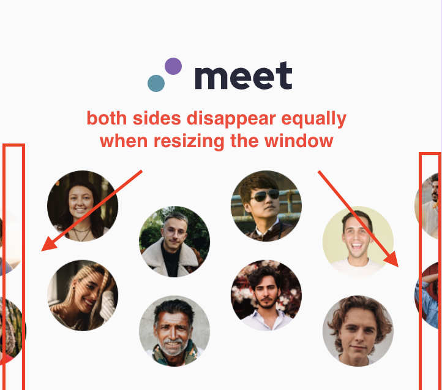

# Frontend Mentor - Meet landing page solution

This is a solution to the [Meet landing page challenge on Frontend Mentor](https://www.frontendmentor.io/challenges/meet-landing-page-rbTDS6OUR). Frontend Mentor challenges help you improve your coding skills by building realistic projects. 

## Table of contents

- [Overview](#overview)
  - [The challenge](#the-challenge)
  - [Screenshot](#screenshot)
  - [Links](#links)
- [My process](#my-process)
  - [Built with](#built-with)
  - [What I learned](#what-i-learned)
  - [Useful resources](#useful-resources)
- [Author](#author)


## Overview

### The challenge

Users should be able to:

- View the optimal layout depending on their device's screen size
- See hover states for interactive elements

### Screenshot


### Links

- [Solution URL](https://github.com/edpau/fm_meet_landing_page)
- [Live Site URL](https://edpau.github.io/fm_meet_landing_page/)

## My process

### Built with

- Semantic HTML5 markup
- CSS Grid
- CSS Flexbox
- CSS BEM
- Mobile-first workflow


### What I learned

#### Image equal cropping on window resize


-  Centering the hero image within a container and ensuring both sides disappear equally when resizing the window.
- I learn to use Flexbox to achieve it. 
- Put the image in an container. 
```html
 <div class="hero__image-container">
            
          </div>
```
- Then 
```CSS
.hero__image-container{
  display: flex;
  justify-content: center;
  width: 100%;
}
```

#### Overlay background color on footer background images 

- I experimented with background-blend-mode:, the result didn't match the figma design, the background image color didn't blend under the background color.
- I used pseudo-element instead to achieve the result.

1. .footer:
  - position: relative;- Ensures the footer is positioned relative to allow the pseudo-element to cover it.
2. .footer::before:
  - content: "";- Creates a pseudo-element.
  - position: absolute;- Positions the pseudo-element absolutely within the footer.
  - top: 0; left: 0; width: 100%; height: 100%;- Ensures the pseudo-element covers the entire footer.
  - background-color: var(--color-background-overlay);
  - opacity: 0.7;- Adjusts the opacity to make the overlay semi-transparent. 
  - z-index: 1;- Ensures the overlay is above the background image but below the content.
3. .footer__content:
  - position: relative;- Ensures the content is positioned relative to the footer.
  - z-index: 2;- Ensures the content is above the overlay.


### Useful resources

- [Resource 1](https://stackoverflow.com/questions/35847458/how-to-resize-an-image-cropping-it-equally-on-each-side-with-css) - Image equal cropping on window resize.


## Author

- Website - [Edward Pau](https://www.edpau.me)
- Frontend Mentor - [@edpau](https://www.frontendmentor.io/profile/edpau)


